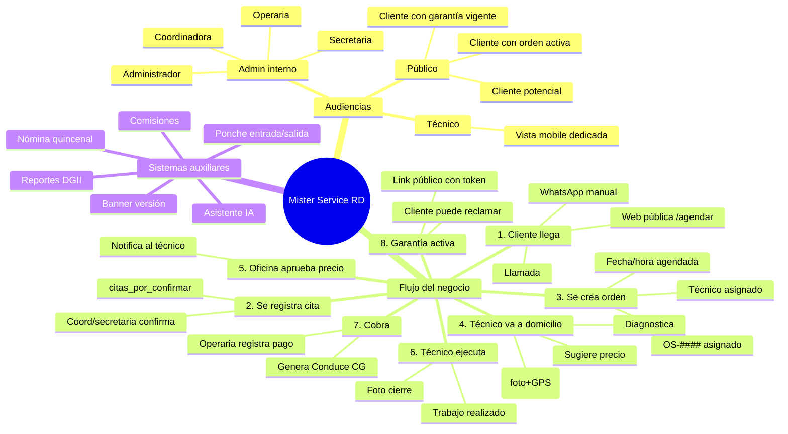
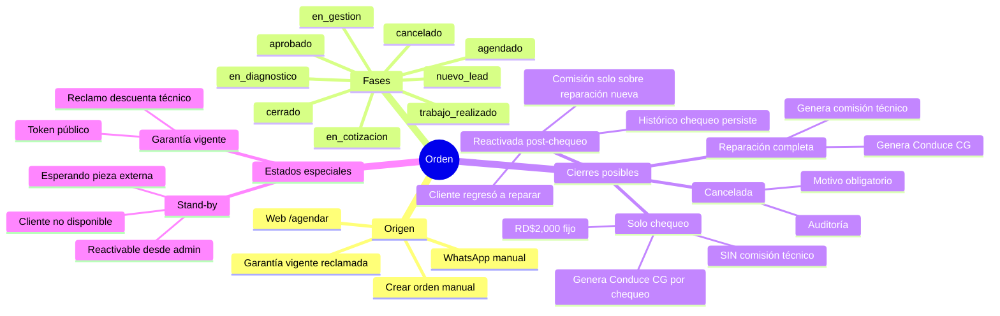
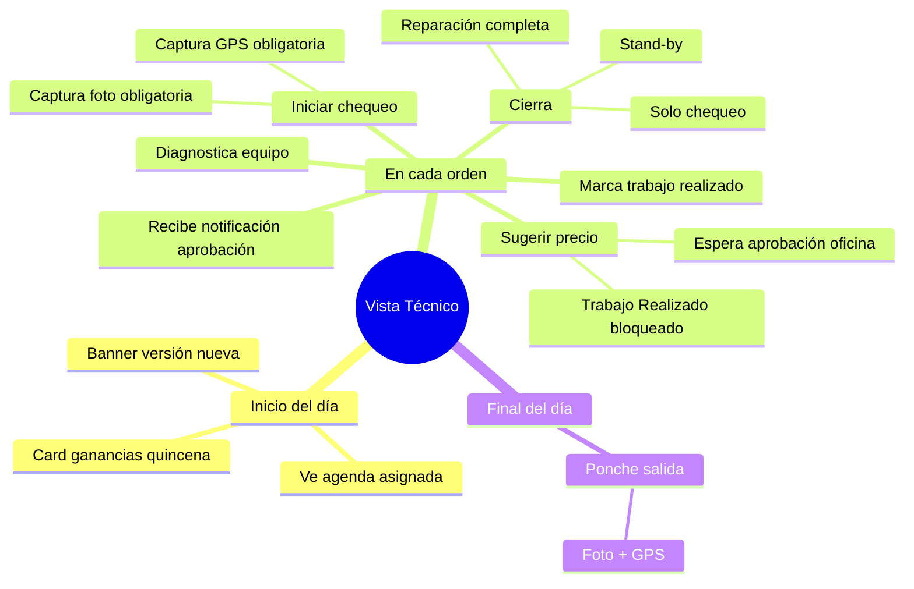
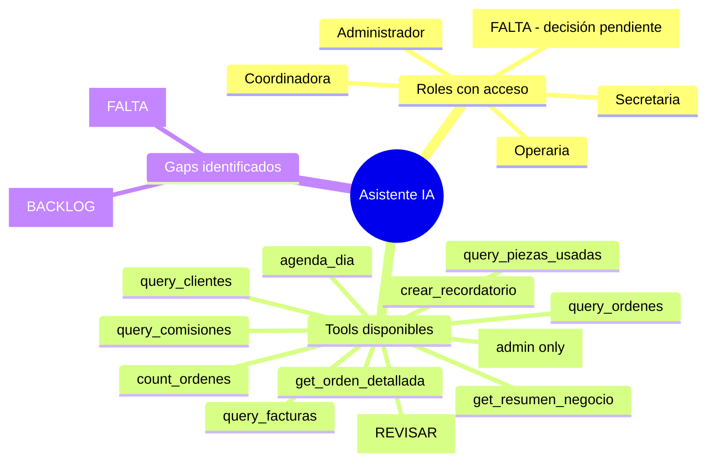
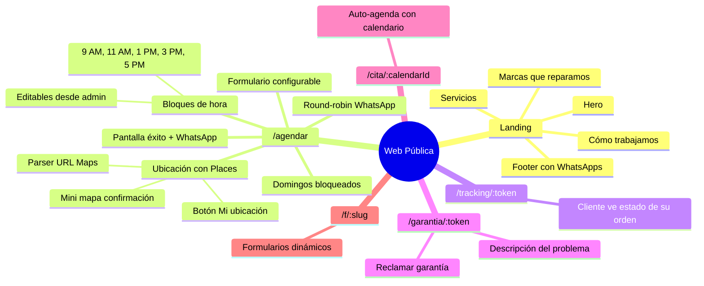
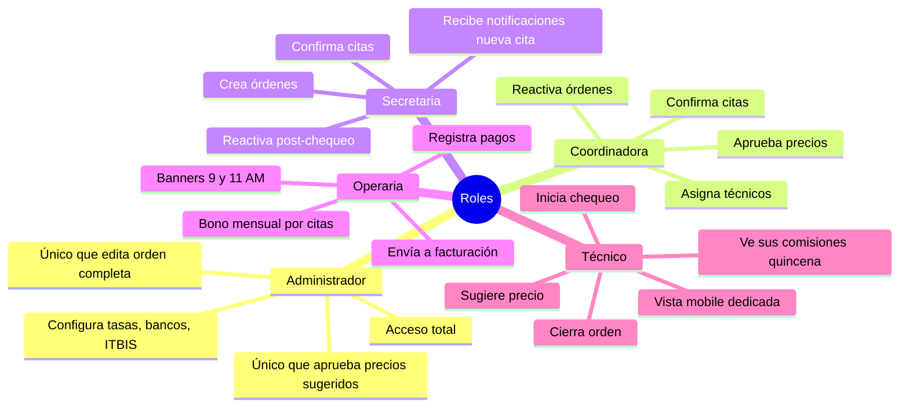
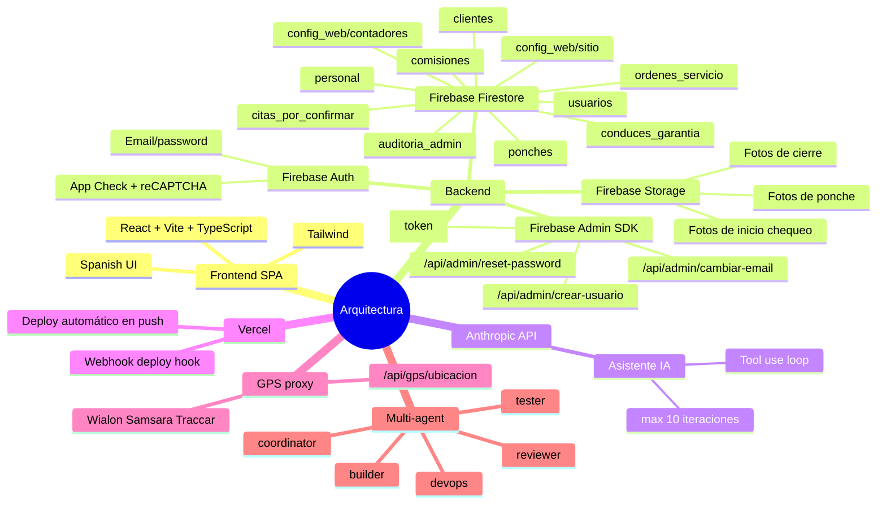
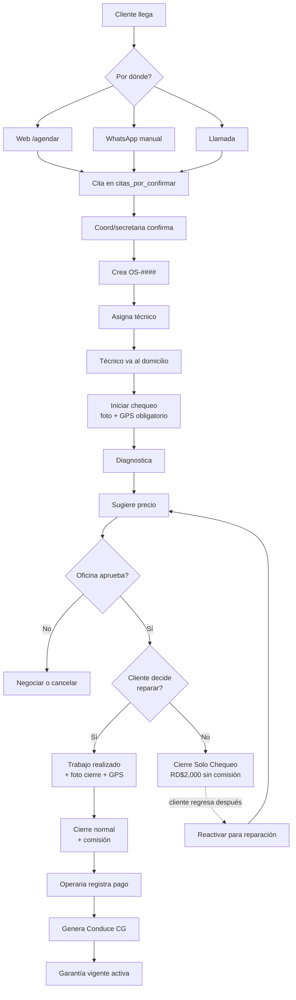

# Mapa Mental — Mister Service RD

> **Propósito:** documento vivo para alinear flujos del negocio entre Jorge y Cowork. **NO modifica el software.** Solo documenta lo que hay, lo que falta y reglas importantes.
>
> **Cómo se actualiza:**
> - Cowork lo regenera al final de cada sprint.
> - Jorge edita libremente: agrega `[FALTA]`, `[REVISAR]`, `[BUG]`, `[DUDA]` en cualquier nodo.
> - Push al repo → GitHub renderiza los diagramas automáticamente.
> - VS Code: instala "Markdown Preview Mermaid Support" para preview en vivo.

---

## 1. Vista general del software

---

## 2. Flujos detallados por módulo

### 2.1 Flujo de orden completa

### 2.2 Flujo del técnico

### 2.3 Asistente IA

### 2.4 Web pública

---

## 3. Reglas críticas de negocio

Estas son las reglas que MÁS importan recordar al planear cualquier sprint:

| # | Regla | Donde aplica |
|---|---|---|
| R1 | El técnico **NO cobra comisión sobre los RD$2,000 del chequeo**, ni siquiera si el cliente regresa después | `utils/comisiones.ts` |
| R2 | Si el cliente regresa para reparar después de un chequeo solo, se **REACTIVA la orden original** (no se crea nueva) | `OrdenCard`, fase pasa a `agendado` |
| R3 | La comisión de la reparación post-chequeo es **solo sobre el monto de reparación**, no incluye los RD$2,000 previos | `utils/comisiones.ts` |
| R4 | El técnico **NO puede marcar "Trabajo Realizado"** hasta que la oficina apruebe el precio sugerido | `TecnicoVista`, gate por `estadoAprobacion` |
| R5 | El precio default del chequeo es **RD$2,000**, configurable en `config/empresa` | `precioChequeoDefault` |
| R6 | Quincenas RD: Q1 día 30→14 paga 15, Q2 día 15→29 paga 30 | `utils/index.ts → rangoQuincena` |
| R7 | Garantía reclamada → **descuenta de la comisión del técnico** que hizo la orden original | Sistema de garantía |
| R8 | Conduces de Garantía (CG-####) son **internos**, paralelos a DGII (sistema sin facturación oficial) | `Refactor Factura→CG` |
| R9 | ITBIS 18% se calcula como referencia interna, no se reporta automáticamente | Configurable |
| R10 | Counters (OS, QT, FAC, CG) usan **transacciones atómicas** — nunca generar números client-side | `contadores.service.ts` |
| R11 | App Check + reCAPTCHA v3 protege endpoints públicos | `/agendar`, `/api/*` |
| R12 | Nunca eliminar permanentemente — usar flags `eliminado: true` para auditoría | Personal, órdenes, clientes |

---

## 4. Roles y permisos (resumen)

---

## 5. Estados de cosas (state machines)

| Cosa | Estados posibles |
|---|---|
| **Orden** | nuevo_lead → en_gestion → en_diagnostico → en_cotizacion → aprobado → agendado → trabajo_realizado → cerrado / cancelado / stand-by |
| **Cita por confirmar** | pendiente → confirmada → cancelada |
| **Conduce CG** | emitido (no se anula, se reemite con nuevo número si hay error) |
| **Garantía** | vigente → reclamada → resuelta (con/sin costo) |
| **Pieza pendiente** | solicitada → en_camino → recibida → instalada / cancelada |
| **Personal** | activo → inactivo → eliminado |
| **Ponche** | abierto (entrada sin salida) → cerrado (con salida) |

---

## 6. Backlog / pendientes

### En curso
- [ ] Sprint flujo técnico — Plan B (reactivar post-chequeo + revertir comisión solo_chequeo). **Pendiente push.**

### Próximos sprints sugeridos
- [ ] **Filtro tecnicoNombre en tools IA** (`PROMPT_TECNICO_NOMBRE.md`) — 30 min
- [ ] **Sprint de pulido** (`PROMPT_PULIDO_POST_AGENDAR.md`) — 2-3h, smells acumulados
- [ ] Actualizar Manual PDF con cambios recientes

### Ideas / preguntas abiertas
- [ ] **Asistente IA para técnicos**: ¿darles acceso? con qué tools? [DECISIÓN PENDIENTE]
- [ ] **Modo voz en IA**: convertir input/output en audio para coord/operaria que tienen las manos ocupadas [BACKLOG]
- [ ] **Notificaciones push reales** (no solo in-app): integración con FCM o similar [BACKLOG]
- [ ] **Reportes de rentabilidad por técnico**: ya hay comisiones, falta dashboard de "quién genera más ingreso neto" [REVISAR]
- [ ] **Sistema de incentivos**: bonos por X órdenes/mes, X clientes nuevos/quincena [BACKLOG]

### Bugs/issues conocidos pero no críticos
- [ ] Markdown injection cosmético en mensaje WhatsApp prellenado (sanitizar `*`, `_`, `~`)
- [ ] `genDireccionId()` no se reusa en `clientes.service` (refactor menor)
- [ ] Race condition tolerable al confirmar cita (improbable, documentado)
- [ ] Campos stand-by quedan stale al reactivar orden
- [ ] `handleConfirmarChequeo` duplicado entre `AgendaDia` + `TecnicoVista`

---

## 7. Cómo se conecta todo (arquitectura mental)

---

## 8. Glosario rápido

| Término | Significado |
|---|---|
| **OS-####** | Orden de Servicio (counter atómico) |
| **CG-####** | Conduce de Garantía (sustituye factura interna) |
| **QT-####** | Cotización |
| **Quincena Q1/Q2** | Q1 = 30 anterior al 14, paga el 15. Q2 = 15 al 29, paga el 30. |
| **Round-robin** | Asignación rotativa de WhatsApps en `/agendar` |
| **Solo chequeo** | Cierre con RD$2,000 sin reparación |
| **Reactivada post-chequeo** | Orden cerrada como solo chequeo que se reabre porque el cliente regresó |
| **Stand-by** | Orden pausada (esperando pieza, cliente no disponible) |
| **App Check** | Firebase feature que bloquea requests sin token reCAPTCHA |
| **parseOrden / parseFactura / parseCita** | Helpers que rehidratan docs de Firestore con tipos correctos |

---

## 9. Flujo end-to-end del negocio

---

> **Convención**: cuando edites este archivo, agrega tu inicial al final del nodo si quieres dejar nota.
> Ejemplo: `Sub1 [J: revisar esto el lunes]`
>
> **Última actualización**: por Cowork al final del sprint flujo técnico Plan B.

